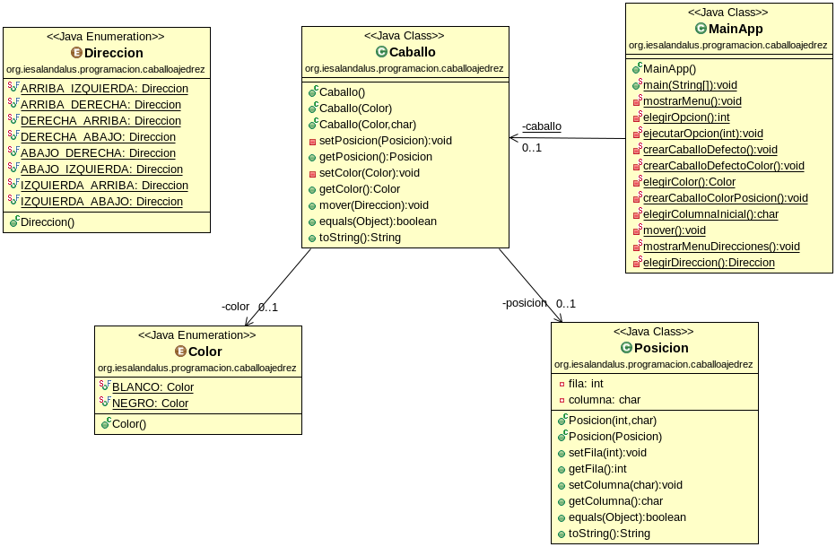

# Ajedrez
# Tarea Caballo Ajedrez
## Profesor: Andrés Rubio del Río
## Alumno:

La tarea va a consistir en modelar el movimiento de un caballo de ajedrez por el tablero de dicho juego. He subido a GitHub un esqueleto de proyecto gradle que ya lleva incluidos todos los test necesarios que el programa debe pasar. Dichos test están todos comentados y deberás ir descomentándolos conforme vayas avanzando con la tarea. La URL del repositorios es la siguiente: repositorio GitHub con el esqueleto del proyecto.

Para ello te pongo un diagrama de clases para el mismo y poco a poco te iré explicando los diferentes pasos a realizar:

1. Lo primero que debes hacer es hacer un fork del repositorio donde he colocado un proyecto gradle con la estructura del proyecto y todos los test necesarios (este repositorio).
2. Clona tu repositorio remoto recién copiado en github a un repositorio local que será donde irás realizando lo que a continuación se te pide.
3. Crea un enumerado llamado `Color`, dentro del paquete adecuado, que contenga los valores: BLANCO y NEGRO. Haz un commit.
4. Crea un enumerado llamado `Direccion`, dentro del paquete adecuado, que contenga los valores: ARRIBA_IZQUIERDA, ARRIBA_DERECHA, DERECHA_ARRIBA, DERECHA_ABAJO, ABAJO_DERECHA, ABAJO_IZQUIERDA, IZQUIERDA_ARRIBA y IZQUIERDA_ABAJO.  Haz un commit.
5. Crea la clase `Posicion`. Crea los atributos fila (`int`) y columna (`char`) con la visibilidad adecuada. Haz un commit.
6. Crea los métodos `get` y `set` para los atributos. Recuerda que para el método set se debe tener en cuenta que los valores son correctos (las filas van del 1 al 8 -ambos inclusive- y las columnas de la 'a' a la 'h' -ambos inclusive-)  y si no se lance una excepción del tipo `IllegalArgumentException` con el mensaje adecuado y no modifique los atributos. Haz un commit.
7. Crea un constructor para esta clase que acepte como parámetros la fila y la columna y que los asigne a los atributos si son correctos  y si no lance una excepción del mismo tipo que la anterior indicando el problema. Haz un commit.
8. Crea el constructor copia para esta clase. Haz un commit.
9. Crea el método `equals` para comparar la igualdad de dos objetos de esta clase. Haz un commit.
10. Crea el método `toString` que devolverá un String y será la representación de la fila y la columna. Haz un commit.
11. Crea la clase `Caballo`, dentro del paquete adecuado, cuyos atributos serán un color (del tipo enumerado `Color`) y posicion (de la clase `Posicion`), con la visibilidad adecuada. Haz un commit.
12. Crea los métodos `get` y `set` para cada atributo con la visibilidad adecuada. Haz un commit.
13. Crea un constructor por defecto para esta clase que cree un caballo negro en la posición '8b'. Haz un commit.
14. Crea un constructor para la clase que acepte como parámetro el color que creará un caballo de dicho color cuya posición será '1b' si es blanco o '8b' si es negro.. Haz un commit.
15. Crea un constructor para la clase que acepte como parámetros el color y la columna inicial. La columna inicial debe ser la 'b' o la 'g' (de lo contrario debe lanzar la excepción `IllegalArgumentException` con un mensaje adecuado) y creara un caballo del color dado y colocado en dicha columna y cuya fila será la 1 si el blanco y la 8 si es el negro.
16. Crea un constructor copia para la clase. Haz un commit.
17. Crea el método mover que dependiendo del movimiento modificará la posición del mismo o si no puede realizar dicho movimiento debe lanzar una excepción del tipo `OperationNotSupportedException` con un mensaje adecuado y no modificará la posición del caballo. Haz un commit.
18. Crea el método `equals` para comparar la igualdad de objetos de la clase. Haz un commit.
19. Crea el método  `toString` que devuelva un String que será la representación de dicho objeto (color y posición). Haz un commit.
20. Crea los diferentes métodos que se indican en el diagrama de clases para permitir que el método main nos muestre un menú que nos permitirá crear un caballo por defecto, crear un caballo de un color, crear un caballo de un color en una columna inicial válida, mover el caballo y salir. Después de cada operación se nos mostrará el estado actual de nuestro caballo. El menú se repetirá mientras no elijamos la opción salir. En todo caso se debe validar que todas las entradas al programa son correctas. Haz un commit.

###### Se valorará:
- La nomenclatura del repositorio de GitHub.

- La indentación debe ser correcta en cada uno de los apartados.

- El nombre de las variables debe ser adecuado.

- Se debe utilizar la clase Entrada para realizar la entrada por teclado.

- El programa debe pasar todas las pruebas que van en el esqueleto del proyecto y toda entrada del programa será validada, para evitar que el programa termine abruptamente debido a una excepción.

- Se valorará la corrección ortográfica tanto en los comentarios como en los mensajes que se muestren al usuario.
